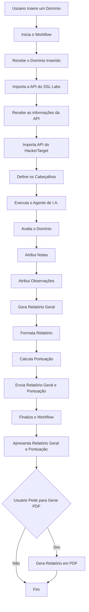

#  Projeto de Segurança de Informação III:
## Automação de Diagnóstico de Vulnerabilidades com IA 
Cenário Utilizado: Cenário 1 - Servidor Web

### Estrutura
O projeto é composto por uma página web que cumpre o papel de front-end e um workflow que cumpre o papel de back-end.
O front-end consiste em um simples formulário onde o usuário pode preencher com o domínio que será analisado, assim ele se comunica com o back-end para adquirir análises e relatórios e mostrá-los na mesma página.
O back-end consiste em um workflow feito através do n8n, que recebe as informações preenchidas no formulário e então realiza a análise dos protocolos SSL/TLS do domínio recebido e envia os resultados adquiridos para o front-end.

### Tecnologias Utilizadas
Para a produção deste projeto as respectivas tecnologias foram utilizadas:
N8N e docker para a produção do workflow do back-end;
HTML, CSS e JavaScript para a produção do front-end.

### Workflow N8N - Backend

#### Nódulo 1 - Webhook
Funciona com a entrada do back-end, recebendo os dados enviados pelo formulário no front-end. Os dados recebidos do front-end se tratam apenas do domínio que será analisado.
	Os parâmetros utilizados para o WebHook foram os seguintes: 
* HTTP Method: POST
* PATH: webguard-ia
* Authentication: None
* Respond: Using “Respond to WebHook” Node.

O WebHook então, exerce a função de coletar o domínio fornecido pelo usuário e dar início ao processo do workflow.

#### Nódulo 2 - SSL Labs
Importa e carrega a API do SSL Labs e verifica se foi baixado corretamente 
	Os parâmetros utilizados foram os seguintes: 
* HTTP Method: GET
* URL: 
```
https://api.ssllabs.com/api/v3/analyze?host={{ $json.body.dominio }}
```
* Authentication: None
* Send Query Parameters: Desselecionado
* Send Headers: Desselecionado
* Send Body: Desselecionado

O nódulo SSL Labs tem a função de carregar a API utilizada para realizar a avaliação do domínio.

#### Nódulo 3 - SSL Labs Details
Lê as informações da API importada.
    Os parâmetros utilizadas foram os seguintes:
* HTTP Method: GET
* URL:  
```
https://api.ssllabs.com/api/v3/getEndpointData?host={{ $('SSL Labs').first().json.host }}&s={{ $('SSL Labs').first().json.endpoints[0].ipAddress }}
```
* Authentication: None
* Send Query Parameters: Desselecionado
* Send Headers: Desselecionado
* Send Body: Desselecionado

Esse nódulo apenas mostra as configurações e definições da API.

#### Nódulo 4 - HackerTarget
Realiza a avaliação do domínio informado trazendo mais informações sobre o domínio para o retorno de notas para o sistema.
	Os parâmetros utilizados para os seguintes: 
* HTTP Method: GET
* URL:
```
https://api.hackertarget.com/httpheaders/?q=https://{{$('SSL Labs').first().json.host}}
```
* Authentication: None
* Send Query Parameters: Desselecionado
* Send Headers: Desselecionado
* Send Body: Desselecionado

O nódulo retorna uma nota entre T, pior resultado possível, e A+, o melhor resultado. Esta informação então é utilizada em conjunto com as próximas adquiridas para formar o relatório final.


### Fluxograma
