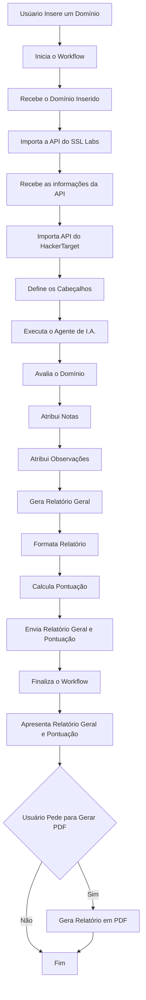

#  Projeto de Segurança de Informação III:
## Automação de Diagnóstico de Vulnerabilidades com IA 
Cenário 1 - Servidor Web

### Estrutura
O projeto é composto por uma página web que cumpre o papel de front-end e um workflow que cumpre o papel de back-end.
O front-end consiste em um simples formulário onde o usuário pode preencher com o domínio que será analisado, assim ele se comunica com o back-end para adquirir análises e relatórios e mostrá-los na mesma página.
O back-end consiste em um workflow feito através do n8n, que recebe as informações preenchidas no formulário e então realiza a análise dos protocolos SSL/TLS do domínio recebido e envia os resultados adquiridos para o front-end.

### Tecnologias Utilizadas
Para a produção deste projeto as respectivas tecnologias foram utilizadas:
N8N e docker para a produção do workflow do back-end;
HTML, CSS e JavaScript para a produção do front-end.

### Workflow N8N - Backend

#### Nódulo 1 - Webhook
Funciona com a entrada do back-end, recebendo os dados enviados pelo formulário no front-end. Os dados recebidos do front-end se tratam apenas do domínio que será analisado.
	Os parâmetros utilizados para o WebHook foram os seguintes: 
    * HTTP Method: POST
    * PATH: webguard-ia
    * Authentication: None
    * Respond: Using “Respond to WebHook” Node.

O WebHook então, exerce a função de coletar o domínio fornecido pelo usuário e dar início ao processo do workflow.

### Fluxograma
