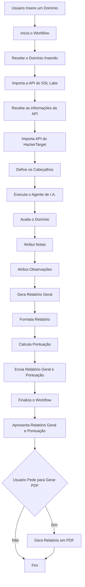

#  Projeto de Segurança de Informação III:
## Automação de Diagnóstico de Vulnerabilidades com IA 
Cenário Utilizado: Cenário 1 - Servidor Web

### Estrutura
O projeto é composto por uma página web que cumpre o papel de front-end e um workflow que cumpre o papel de back-end.
O front-end consiste em um simples formulário onde o usuário pode preencher com o domínio que será analisado, assim ele se comunica com o back-end para adquirir análises e relatórios e mostrá-los na mesma página.
O back-end consiste em um workflow feito através do n8n, que recebe as informações preenchidas no formulário e então realiza a análise dos protocolos SSL/TLS do domínio recebido e envia os resultados adquiridos para o front-end.

### Tecnologias Utilizadas
Para a produção deste projeto as respectivas tecnologias foram utilizadas:
N8N e docker para a produção do workflow do back-end;
HTML, CSS e JavaScript para a produção do front-end.

### Workflow N8N - Backend

#### Nódulo 1 - Webhook
Funciona com a entrada do back-end, recebendo os dados enviados pelo formulário no front-end. Os dados recebidos do front-end se tratam apenas do domínio que será analisado.
	Os parâmetros utilizados para o WebHook foram os seguintes: 
* HTTP Method: POST
* PATH: webguard-ia
* Authentication: None
* Respond: Using “Respond to WebHook” Node.

O WebHook então, exerce a função de coletar o domínio fornecido pelo usuário e dar início ao processo do workflow.

#### Nódulo 2 - SSL Labs
Importa e carrega a API do SSL Labs e verifica se foi baixado corretamente 
	Os parâmetros utilizados foram os seguintes: 
* HTTP Method: GET
* URL: 
```
https://api.ssllabs.com/api/v3/analyze?host={{ $json.body.dominio }}
```
* Authentication: None
* Send Query Parameters: Desselecionado
* Send Headers: Desselecionado
* Send Body: Desselecionado

O nódulo SSL Labs tem a função de carregar a API utilizada para realizar a avaliação do domínio.

#### Nódulo 3 - SSL Labs Details
Lê as informações da API importada.
    Os parâmetros utilizadas foram os seguintes:
* HTTP Method: GET
* URL:  
```
https://api.ssllabs.com/api/v3/getEndpointData?host={{ $('SSL Labs').first().json.host }}&s={{ $('SSL Labs').first().json.endpoints[0].ipAddress }}
```
* Authentication: None
* Send Query Parameters: Desselecionado
* Send Headers: Desselecionado
* Send Body: Desselecionado

Esse nódulo apenas mostra as configurações e definições da API.

#### Nódulo 4 - HackerTarget
Realiza a avaliação do domínio informado trazendo mais informações sobre o domínio para o retorno de notas para o sistema.
	Os parâmetros utilizados para os seguintes: 
* HTTP Method: GET
* URL:
```
https://api.hackertarget.com/httpheaders/?q=https://{{$('SSL Labs').first().json.host}}
```
* Authentication: None
* Send Query Parameters: Desselecionado
* Send Headers: Desselecionado
* Send Body: Desselecionado

O nódulo retorna uma nota entre T, pior resultado possível, e A+, o melhor resultado. Esta informação então é utilizada em conjunto com as próximas adquiridas para formar o relatório final.

#### Nódulo 5 - Security Headers
Ajudam a identificar se o servidor segue boas práticas de segurança contra ataques como clickjacking, XSS e MIME Sniffing.
    Os parâmetros utilizadas foram os seguintes:
* Mode: Run Once for All Items
* Language: JavaScript

* JavaScript:
```js

const raw = $json.data $json.body $json || ""; 
const texto = typeof raw === "string" ? raw : JSON.stringify(raw); function extrairHeader(nome) { 
 const regex = new RegExp(${nome}:\\s*(.*), "i"); 
 const match = texto.match(regex); 
 return match ? match[1].trim() : "Ausente";
} 

return [ 
 { 
  json: { 
   headers: { 
    hsts: extrairHeader("strict-transport-security"), 
    csp: extrairHeader("content-security-policy"), 
    xFrameOptions: extrairHeader("x-frame-options"),                  
    xContentTypeOptions: extrairHeader("x-content-type-options"),
    referrerPolicy: extrairHeader("referrer-policy"),
    permissionsPolicy: extrairHeader("permissions-policy"),
    server: extrairHeader("server"),
    xPoweredBy: extrairHeader("x-powered-by"),
    xXssProtection: extrairHeader("x-xss-protection") 
   }, rawHeaders: texto 
  } 
 } 
]; 


```
Aponta elementos relevantes para o cálculo da pontuação, avaliando as práticas utilizadas para a segurança do sistema e realiza sugestões de melhoria para o sistema.
Esta informação então é utilizada em conjunto com as próximas adquiridas para formar o relatório final.

#### Nódulo 6 - Agente de I.A.
O agente de I.A. é utilizado para adquirir um resumo do resultado geral, coletar as informações da API, apresentar as informações coletadas, realizar uma análise técnica e fazer recomendações de alterações e mudanças para o sistema.
    Os parâmetros utilizadas foram os seguintes:
* Source for Prompt (User Message): Define Below
* Prompt (User Message): 
``` 
Você é um especialista em Segurança da Informação. Analise os dados abaixo de um servidor web.

Domínio:
{{ $('SSL Labs').first().json.host }}

Status SSL Labs:
{{ $('SSL Labs').first().json.status }}

Porta:
{{ $('SSL Labs').first().json.port }}

Nota SSL:
{{ $('SSL Labs').first().json.endpoints[0].grade }}

Endpoints:
{{ JSON.stringify($('SSL Labs').first().json.endpoints, null, 2) }}

Security Headers:

HSTS:
{{ $('Security Headers').first().json.headers.hsts }}

Content-Security-Policy:
{{ $('Security Headers').first().json.headers.csp }}

X-Frame-Options:
{{ $('Security Headers').first().json.headers.xFrameOptions }}

X-Content-Type-Options:
{{ $('Security Headers').first().json.headers.xContentTypeOptions }}

Referrer-Policy:
{{ $('Security Headers').first().json.headers.referrerPolicy }}

Dados técnicos SSL/TLS disponíveis:
Protocolos:
{{ JSON.stringify($('SSL Labs Details').first().json.details.protocols || [], null, 2) }}

Cipher Suites:
{{ JSON.stringify($('SSL Labs Details').first().json.details.suites || [], null, 2) }}

Recursos:
Forward Secrecy: {{ $('SSL Labs Details').first().json.details.forwardSecrecy }}
OCSP Stapling: {{ $('SSL Labs Details').first().json.details.ocspStapling }}
RC4: {{ $('SSL Labs Details').first().json.details.supportsRc4 }}
Compressão TLS: {{ $('SSL Labs Details').first().json.details.compressionMethods }}
ALPN: {{ $('SSL Labs Details').first().json.details.alpnProtocols }}

Considere:
- A nota SSL obtida.
- Os endpoints analisados.
- Protocolos TLS suportados.
- Cipher Suites.
- Certificado digital quando disponível.
- Security Headers presentes e ausentes.
- Boas práticas de segurança para aplicações web.

Não invente informações.
Use somente os dados recebidos.

Gere:
- resumo executivo com 5 a 7 linhas;
- análise técnica completa;
- recomendações objetivas.

Na seção "recomendacoes", gere todas as recomendações necessárias com base nos problemas encontrados.
Não existe limite de quantidade.
Ordene as recomendações da maior para a menor prioridade.
Não repita recomendações.

Responda SOMENTE com JSON válido neste formato:

{
  "resumo": "Texto obrigatório com 5 a 7 linhas.",
  "relatorioTecnico": {
    "coleta": "Texto obrigatório.",
    "sslTls": "Texto obrigatório.",
    "certificado": "Texto obrigatório.",
    "protocolos": "Texto obrigatório.",
    "cipherSuites": "Texto obrigatório.",
    "vulnerabilidades": "Texto obrigatório.",
    "securityHeaders": "Texto obrigatório.",
    "impactos": "Texto obrigatório.",
    "conclusao": "Texto obrigatório."
  },
  "recomendacoes": [
    "Recomendação objetiva baseada nos achados encontrados"
  ]
}
``` 

* Require Specific Output Format: Selecionado
* Enable Fallback Model: Desselecionado

As informações geradas pelo agente de IA serão utilizadas para o Front-end.

##### Nódulo 6.1 - Google Gemini 2.5 Flash
Conecta a I.A. do Google Gemini com o Agente I.A.
    Os parâmetros utilizadas foram os seguintes:
* Credential: Google Gemini{PaLM} Api Account
* Model: models/gemini-2.5-flash

##### Nódulo 6.2 - Structured Output Parser
Estrutura a informação gerada pela I.A. para que ela possa ser apresentada no front-end.
    Os parâmetros utilizados foram os seguintes:
* Schema Type: Generate From JSON Example
* JSON Example: 
```json
{
  "resumo": "...",
  "relatorioTecnico": {
    "coleta": "...",
    "sslTls": "...",
    "certificado": "...",
    "protocolos": "...",
    "cipherSuites": "...",
    "vulnerabilidades": "...",
    "securityHeaders": "...",
    "impactos": "...",
    "conclusao": "..."
  },
  "recomendacoes": [
    "...",
    "..."
  ]
}

```

#### Nódulo 7 - Código JavaScript
Utiliza um sistema próprio para calcular a nota e retornar ela, puxa os resultados das APIs utilizadas e completa o relatório geral. O código é baseado no cálculo do Mozilla Observatory.
* Mode: Run Once for All Items
* Language: JavaScript
* JavaScript: 
```
https://github.com/victtows/PSI-III/blob/main/docs/codeinjs.txt
```	
Então o resultado é passado para a frente para que seja apresentado no front-end.

#### Nódulo 8 - Respond to Webhook
Envia as informações para o front-end.
    Os parâmetros utilizados foram os seguintes:
* Respond With: JSON
* Authentication: {{ $json }}
A última atividade do workflow, o nódulo envia todas as informações adquiridas e as envia para o front-end, já em um formato que é compatível com o front-end.


### Fluxograma
