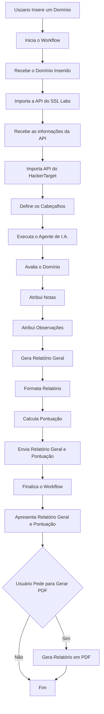

```mermaid
graph TD
    A[Usúario Insere um Domínio] -->| | B[Inicia o Workflow];
    B --> C[Recebe o Domínio Inserido];
    C -->| | D[Importa a API do SSL Labs];
    D -->| | E[Recebe as informações da API];
    E -->| | F[Importa API do HackerTarget];
    F -->| | G[Define os Cabeçalhos];
    G -->| | H[Executa o Agente de I.A.];
    H -->| | I[Avalia o Domínio];
    I -->| | J[Atribui Notas];
    J -->| | K[Atribui Observações];
    K -->| | L[Gera Relatório Geral];
    L -->| | M[Formata Relatório];
    M -->| | N[Calcula Pontuação];
    N -->| | O[Envia Relatório Geral e Pontuação];
    O -->| | P[Finaliza o Workflow];
    P -->| | Q[Apresenta Relatório Geral e Pontuação];
    Q -->| | R{Usuário Pede para Gerar PDF};
    R -->| Sim | S[Gera Relatório em PDF];
    R -->| Não | T[Fim];
    S -->| | T;
```